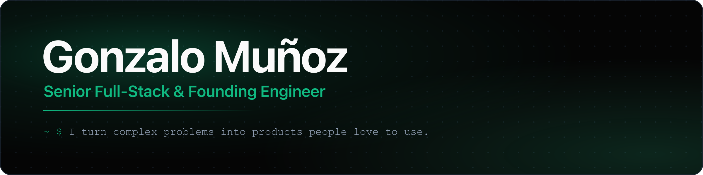
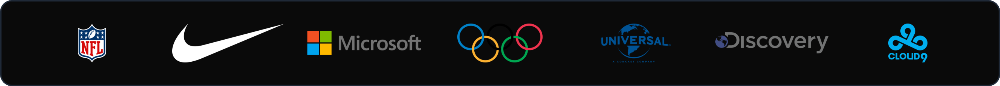
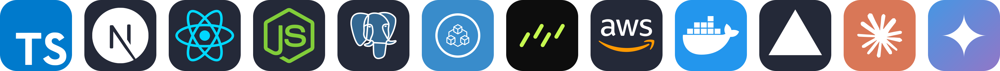

  

<b>Product-minded engineer</b> — I own features end to end, from the first call to the shipped product.

  
  
  
  

  
  
  
  

## 🤝 Brands I've built for

  
   
  Client work earlier in my career (via SOUTHWORKS &amp; StartupLandia) — shipping products used at scale by these brands.

## 🚀 Selected work

**[EventureX](https://www.eventurex.com.ar)** &nbsp;·&nbsp; *Founder* 
The product I'm building — a multi-tenant event OS: canvas venue-map editor, offline QR/NFC ticket validation, dynamic pricing, AI marketing tools. **Powering thousands of tickets across real-world events.**

**[FocusWithFred](https://www.focuswithfred.com)** &nbsp;·&nbsp; *Founding Engineer* 
A **legal-tech** trial simulator — litigators upload a case, an opening/closing argument, or video evidence, and Fred recruits real jurors to evaluate it, returning reports on win likelihood, damage range, how jurors weigh evidence, and AI-curated insights from their feedback. **Contributed to multiple multi-million-dollar trial outcomes.**

**[Tandem Digital](https://tandemdigital.net/)** &nbsp;·&nbsp; *Engineering Consultant* 
Client-facing document tools — a RAG assistant with hybrid **keyword + semantic (vector)** search and chat over **hundreds of thousands of documents**, plus a file-extraction pipeline. In production at scale.

**[HumanJS](https://humanjs.dev)** &nbsp;·&nbsp; *Creator · Open source · [`totigm/humanjs`](https://github.com/totigm/humanjs)* 
Humanized browser automation for AI agents, QA tests & demos — Playwright-first, Bézier mouse paths, natural typing rhythm, composable personalities, an MCP server, and recording to video or runnable tests.

## 🛠️ Stack

  
   
  My default stack — but every project earns its own analysis. I use the right tool for the job.

## ✨ Currently

Scaling <b>EventureX</b> &nbsp;·&nbsp; building <b>HumanJS</b> &nbsp;·&nbsp; shipping AI-powered products

---

<a href="https://munoz.dev">Portfolio</a> &nbsp;·&nbsp; <a href="https://www.linkedin.com/in/totigm">LinkedIn</a> &nbsp;·&nbsp; <a href="https://calendly.com/gonzamunoz/30min">Book a call</a> &nbsp;·&nbsp; <a href="mailto:gonza@munoz.dev">gonza@munoz.dev</a>

